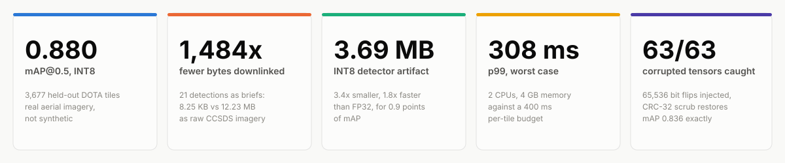
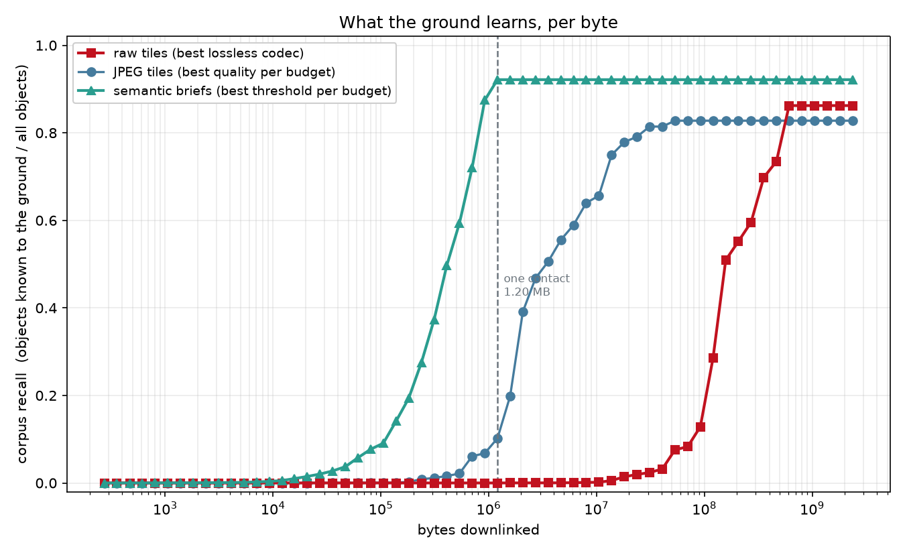
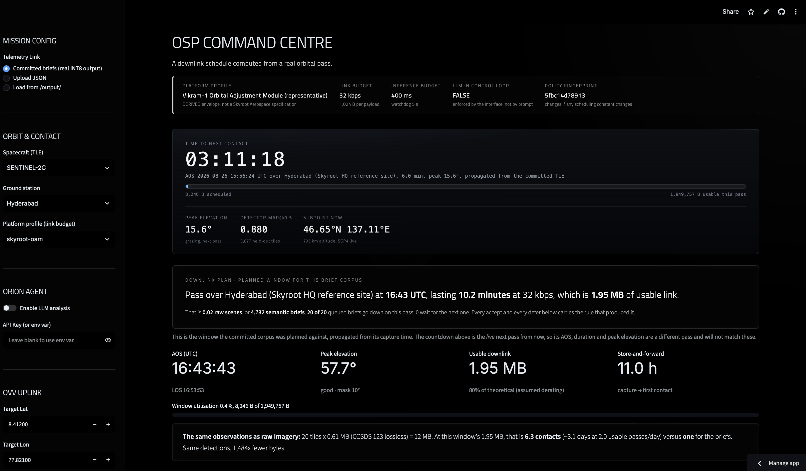
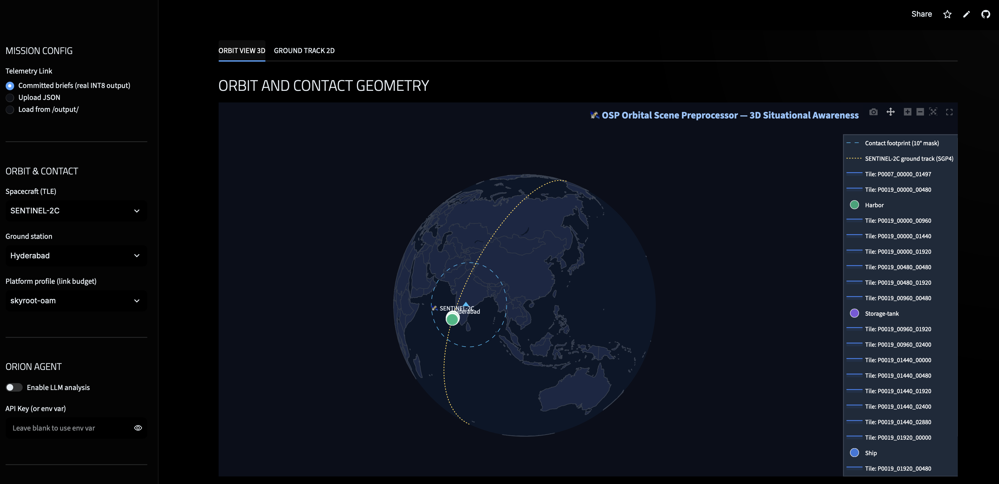

# Orbital Scene Preprocessor

A satellite can photograph far more than it can send home. OSP decides what goes.

Detection runs on-orbit, so what comes down is not the image but a few hundred bytes saying *what* was found, *where*, and *how confident*. A hand-derived orbital mechanics stack propagates the real element set to know exactly how many bytes the next ground pass affords. A language model narrates the outcome and is architecturally unable to override it.

Over 20 held-out tiles that is **1,484x fewer bytes downlinked, at equal detection accuracy.**

[Open the live command centre](https://osp-command-centre.streamlit.app/) · [How it works, derived from first principles](architecture.md)

[](https://github.com/brightyorcerf/orbital-preprocessor/actions/workflows/tests.yml)



Five numbers, each backed by a committed artifact and a script that regenerates it. Everything below derives them.

---

## The constraint that shapes everything

- A Sentinel-2 scene costs about **180 MB** losslessly compressed (CCSDS 123, the standard written for this job).
- A real ground station pass, SGP4-propagated over Hyderabad at a 10° elevation mask, affords about **1.95 MB**.
- That's **1%** of a scene per contact, and the camera doesn't wait: the backlog grows faster than the link drains it, forever.

There is no patience strategy and no better compression of pixels that closes a factor of 93 while the sensor keeps running. CCSDS 123 *is* the better compression of pixels. So on-board inference is not an optimisation here, it is the only operating point that exists.

That 1.95 MB is computed, not assumed. `orbital/` runs a committed CelesTrak TLE snapshot through SGP4, hand-written frame conversions, real ground stations, and a bisection-refined contact scheduler. The frame conversions are checked against Skyfield (test-only, never imported at runtime) over 24 hours: worst case **38.5 m** in slant range, 0.0003° in elevation. The profile constant this project started with guessed 5.0 contact minutes; the propagated geometry says 10.155. Both numbers are still in the repo, labelled, because the guess being wrong by 2x is the point.

The dashboard's ground track is the same propagation, not an illustration. It used to be a circle at the wrong inclination, rotated by a fixed offset so it would cross the demo scene: three separate fictions stacked to make the picture come out right. There is now deliberately no synthetic fallback, so if the orbital layer is unavailable the globe draws no track at all, on the grounds that a plausible-looking fake orbit next to real detections is worse than an empty globe.

Full derivation of the division above, and of the wire format it forces, in [architecture.md §1–2](architecture.md).

---

## The thesis, in one chart



Fix a byte budget, then ask how many of the 9,472 labelled objects in the corpus the ground actually learns about. At the one-contact line, briefs are at **0.92** corpus recall, the best JPEG operating point is at **0.10**, and raw lossless imagery is at **0.00**. The curves never cross: there is no budget at which sending pixels beats sending briefs.

`ground/rate_distortion.py` scores the whole corpus against the budget, including tiles that never fit a contact, so the accounting is not quietly restricted to the cases that flatter it. Briefs are priced as the minified JSON the scheduler actually reads, not as the smaller protobuf, so the comparison is charged the larger number.

(The dashed line is the profile constant, 32.0 kbps × 5.0 min = 1,200,000 B. The propagated Hyderabad window is 1.95 MB, so the chart is drawn against the conservative budget.)

The table behind this chart, with per-strategy recall and precision, is in [Compression](#compression).

---

## The LLM cannot touch the decision

The language model narrates the outcome and cannot change it. This is enforced structurally, not by prompt.

- `agent/mission_controller.py` computes alert level deterministically from the detection payload. The model can escalate a narrated severity but **never de-escalate** it.
- `DownlinkScheduler.plan()` takes no model hook. The resulting `DownlinkPlan` is frozen before the model ever sees it.

Three tests hold the line: one **fails if a model hook is ever added to the scheduler's signature**, one proves the plan is byte-identical regardless of run order, one proves narration cannot mutate the plan. The first of those is the one worth reading, because it makes the boundary a property of the type signature rather than a convention someone remembers to follow.

What the model layer actually is, so its size is not left to the imagination: retrieval is a dot product against a 14-chunk corpus of domain notes, and episodic memory is a SQLite table of past detections by location so an analysis can say what changed since the last pass. No vector database, no fine-tune. Both are deliberately small, because the argument this project makes does not route through them.

The boundary is softer in exactly one place and [architecture.md §6](architecture.md) names it: `_decide_ovv` accepts a model-authored proposal into an action list, tagged `source="llm"`, where it can outbid a policy request for the last of three slots. It never reaches the scheduler and never changes an alert level. That edge case, and the one-line fix for it, are documented rather than hidden.

---

## Failure behavior

The interesting fault is not the one that crashes. Single-event upsets in INT8 weight memory produce a failure that gets **louder** as it gets worse: past 1% of weight memory flipped, the detector emits **19x the clean detection count**, all of it wrong, with no error raised anywhere in the stack. A model that goes quiet is obvious. A model that goes confidently loud is not.

An out-of-band CRC-32 scrub catches it and repairs the artifact to byte-identical in **11 ms**, with no model reload. The committed sweep and the collapse curve are in [Fault tolerance](#fault-tolerance).

Alongside that, every declared fallback in `config/platforms.py` (watchdog timeout, latency budget, model-failure behavior) resolves to a real handler and is exercised by a test; an engine refuses to start against a profile whose declared fallback has no implementation.

One gap is open and stated rather than papered over: the `degraded` flag exists on the JSON path the pipeline actually uses, and **not** in the protobuf schema, so a degraded brief round-tripped through the declared wire format arrives looking healthy. [architecture.md §2](architecture.md) demonstrates it and scopes the fix.

---

## Data flow

```
ON-BOARD (constrained)                    │  GROUND (unconstrained)
──────────────────────                    │  ─────────────────────
6-band tile  (640×640×6, 0.61 MB on wire) │
  → INT8 detector      88 ms              │
  → per-class NMS                         │
  → pixel → lat/lon                       │
  → protobuf brief     154 B              │
        ↓                                 │
  ┌─ DOWNLINK SCHEDULER ─────────┐        │
  │  committed TLE → SGP4        │        │
  │  → look angles vs station    │        │
  │  → AOS/LOS at elevation mask │        │
  │  → byte budget               │        │
  │  → priority sort → what fits │        │
  └──────────────────────────────┘        │
        ↓  (only what fits)               │
    ~~ contact window ~~ ─────────────────┼──→  RAG retrieval (embeddings)
                                          │       → episodic memory (SQLite)
                                          │       → LLM writes the analysis
                                          │              ↓
                                          │       PolicyEngine  ← holds authority
                                          │              ↓
                                          │       reconciled verdict → tasking request
```

Left of the line runs on a compute budget. Right of the line does not. The 88 ms is
the INT8 inference median at two cores, the constraint the left column is under; the
full distribution is in [Latency](#latency).




---

## Results

### Compression

Priced over **1,000 held-out DOTA tiles, 9,472 labelled objects**. Contact budget: 32.0 kbps x 5.0 min = 1,200,000 B.

| Strategy | Bytes/tile | Recall | Precision | Tiles per contact |
| :--- | ---: | ---: | ---: | ---: |
| **raw, lossless (CCSDS 123)** | **592,934** | 0.862 | 0.920 | **2.0** |
| raw, lossless (PNG) | 2,366,944 | 0.862 | 0.920 | 0.5 |
| JPEG q75 | 53,317 | 0.828 | 0.920 | 22 |
| JPEG q30 | 26,079 | 0.814 | 0.925 | 46 |
| JPEG q2 | 8,291 | 0.507 | 0.846 | 145 |
| brief @ conf 0.20 | 951 | 0.893 | 0.873 | 1,262 |
| **brief @ conf 0.35** | **894** | **0.862** | **0.920** | **1,343** |
| brief @ conf 0.65 | 755 | 0.707 | 0.974 | 1,590 |
| brief @ conf 0.80 | 273 | **0.000** | **0.000** | 4,396 |

The brief at conf 0.35 ties raw lossless exactly, for 1/663rd the bytes. Above conf ~0.7 the detector goes silent: zero detections across all 9,472 objects, still costing 273 B/tile of envelope. That's a hard operating-envelope constraint.

Priced against a real pass rather than a corpus average: **20 held-out tiles as raw imagery** (CCSDS 123) is 12,234,137 B, 6.3 contacts. **The same 20 tiles as briefs** is 8,246 B, one pass, using 0.42% of it. Same 21 detections, **1,484x** fewer bytes. That prices briefs as the minified JSON the scheduler accounts; as protobuf the same corpus is 3,087 B.

```bash
python ground/rate_distortion.py --tiles val/images --labels val/labels --limit 1000
```

### Latency

Measured as a distribution over 95 held-out DOTA tiles, not as a mean. Held to two cores and 4 GB, **p99 end to end is 307.65 ms against the platform's 400 ms budget**: the margin holds at the tail, not just the median.

This is x86 under cgroups, not ARM. A Pi 5 or an Orin Nano has a different instruction mix, so these numbers are a resource-constrained proxy and nothing more.

<details>
<summary>Full quantile breakdown, preprocess vs inference</summary>

| | p50 | p95 | p99 | mean |
|---|---|---|---|---|
| **Host, unconstrained** (4 cores) | | | | |
| preprocess | 56.93 | 102.48 | 226.14 | 56.88 |
| inference | 50.19 | 54.57 | 60.50 | 51.02 |
| end to end | 106.02 | 154.64 | 282.54 | 107.89 |
| **Constrained** (`--cpus 2 --memory 4g`) | | | | |
| preprocess | 87.24 | 140.01 | 215.93 | 88.14 |
| inference | 88.07 | 113.72 | 185.76 | 82.44 |
| end to end | 168.91 | 232.71 | 307.65 | 170.58 |

Milliseconds. Raw output committed under `docs/latency/`. Note that at two cores preprocessing costs more than inference at p50: `rgb_to_6band`'s two resize calls, not the detector.

</details>

### Fault tolerance

Single-event upsets injected uniformly into 25,026,816 bits of quantised weight memory, real DOTA detector, 96 held-out tiles:

| Weight bits flipped | Share of weight memory | mAP@0.5 | Detections emitted |
| ---: | ---: | ---: | ---: |
| 0 | 0% | 0.836 | 856 |
| 16,384 | 0.07% | 0.801 | 643 |
| 131,072 | 0.52% | 0.030 | 45 |
| 1,048,576 | 4.19% | 0.000 | **16,548** |

Below 0.13% of weight memory the model is essentially undisturbed; between 0.13% and 0.52% it collapses; past 1% it goes silent-then-loud, 19x the clean detection count, all of it wrong, with no error raised anywhere in the stack.

A CRC-32 per weight tensor catches it out of band: 252 B of state against a 3.69 MB artifact, verified in 11 ms. The committed sweep runs the full loop: 65,536 flips across all 63 weight tensors, 63 of 63 detected, mAP 0.836 → 0.359 → 0.836, restored exactly.

```bash
python resilience/degradation.py --images val/images --labels val/labels --tiles 96
python -m pytest tests/test_resilience.py -v
```

### Detection accuracy

**3,677 held-out tiles** from DOTA-v1.0, 34,918 labelled instances, none seen during training. Scored through the deployed decision path: same NMS, same class map, same confidence threshold flight code uses.

| | FP32 checkpoint | INT8 (what ships) |
| :--- | ---: | ---: |
| **mAP@0.5** | **0.889** | **0.880** |
| **mAP@0.5:0.95** | **0.576** | **0.544** |
| ship *(19,651 instances)* | 0.960 | 0.952 |
| airplane *(5,464)* | 0.944 | 0.930 |
| harbor *(4,626)* | 0.845 | 0.844 |
| storage-tank *(5,177)* | 0.807 | 0.794 |

Storage-tank recall is 0.653 at precision 0.936: the model isn't confusing tanks with something else, it's failing to find them. That's the honest weak point of this detector.

DOTA is aerial, roughly 0.1 to 1 m ground sample distance, and the orbital layer models 10 m. **0.880 mAP is a real measurement on real photographs of the right four classes, and it is not a claim about orbital imagery.** `tools/generate_briefs.py` refuses to mint Sentinel-2 footprint fields from these tiles without an explicit flag, and with the flag every brief's provenance records that the geolocation is approximate and why. What transfers is the engineering; what does not is this number. [architecture.md](architecture.md) opens its reviewer questions with exactly this objection.

```bash
python model/evaluate_detector.py --onnx model/artifacts/osp_yolov8n_int8.onnx \
    --images val/images --labels val/labels
```

### Quantization

**3.43x smaller and 1.83x faster, for 0.9 points of mAP@0.5.** Static INT8 post-training quantization (QDQ, per-channel weights), chosen over dynamic quantization specifically because dynamic makes latency data-dependent, and the assurance story rests on bitwise-identical output across runs.

<details>
<summary>Full FP32 vs INT8 comparison</summary>

| Metric | FP32 | INT8 | |
| :--- | ---: | ---: | :--- |
| Artifact size | 12.67 MB | 3.69 MB | 3.43x smaller |
| Latency (CPU, 640², sequential) | 94.1 ms | 51.4 ms | 1.83x faster |
| Mean relative divergence | n/a | 2.11 % | max 2.81 % |
| **mAP@0.5** (3,677 real tiles) | **0.889** | **0.880** | costs 0.9 points |
| **mAP@0.5:0.95** | **0.576** | **0.544** | costs 3.2 points |
| Bitwise determinism | n/a | PASS | identical output across runs |
| `skyroot-oam` 400 ms budget | Met | Met | 7.8x margin |

</details>

```bash
python model/benchmark_quantization.py --platform skyroot-oam
```

---

## Evaluation

**113 tests locally, all passing.** CI collects the same 113 and runs 97; the 16 that need a trained artifact, a validation split or torch skip visibly rather than being dropped from the run.

| Suite | Covers |
| :--- | :--- |
| `tests/test_orbital.py` (43) | TLE parsing conventions, frame conversions against Skyfield, pass geometry, the scheduling policy, and the authority boundary |
| `tests/test_resilience.py` (33) | Fault injection into INT8 weights, dead spectral bands, watchdog overruns, hard model failure, corrupted briefs, plus coverage over `AssuranceProfile` itself |
| `tests/test_pipeline.py` (16) | Tensor contracts, geo-projection, protobuf round-trip, memory budget, tile-storage equivalence, DOTA label conversion, rate-distortion accounting, and an accuracy floor on the trained detector |
| `tests/test_protect.py` (8) | CRC-32 weight manifest, upset detection across all 63 tensors, and scrub-to-byte-identical repair |
| `tests/test_raw_pricing.py` (7) | The CCSDS denominator every compression claim divides by, pinned against the committed manifest |
| `tests/test_ccsds.py` (6) | The CCSDS 123.0-B-1 encoder itself: predictor, Golomb coder, round-trip |
| `ground/eval_suite.py` (6 axes) | LLM faithfulness: schema validity, entity grounding, coordinate fidelity, numeric fidelity, citation validity, policy consistency |

`eval_suite.py`'s composite is the **minimum** across axes, not the mean: a brief that invents coordinates is not redeemed by having valid JSON.

A green suite is not the claim, so this one is checked by mutation as well as by running it: disabling the watchdog comparison fails two tests, letting a degraded brief become the last-known-good fails a third, and the band-dropout sweep carries a control row that must score 0.000 so the null results above it are known to come from a harness that bites. [architecture.md](architecture.md) records what each suite is and is not evidence for.

---

## Run it

```bash
conda create -n osp_dev python=3.10 -y && conda activate osp_dev
pip install -r requirements.txt
pip install -e .                       # puts the repo root on the import path

streamlit run ground/dashboard.py      # launch the command centre
python -m pytest tests/ -v             # 113 tests
```

No API key is baked in; ORION reads one from the sidebar for the visitor's own session. Everything upstream of the reasoning layer, perception, quantization, serialization, the policy engine, runs without any key or network access.

The shipping weights come from `tools/kaggle_train_dota.ipynb` (DOTA-v1.0, 32 epochs on a Tesla P100). To reproduce or extend:

```bash
python train.py --quick --export       # ~3 min smoke test of the full pipeline, synthetic corpus
python inference/engine.py --model model/artifacts/osp_yolov8n_int8.onnx \
  --tiles osp_dataset/images/val --out data/telemetry_out --platform skyroot-oam
python tools/generate_briefs.py        # regenerate the committed brief corpus
python tools/verify_docker_repro.py    # diff a container rebuild against what's committed
```

Full commands for training from scratch, the DOTA reproduction path, and TLE tooling are in [architecture.md](architecture.md).

---

## Tech stack

| Layer | Built with |
| :--- | :--- |
| Detector | PyTorch, Ultralytics YOLOv8n (6-ch stem, 4-class head), custom training loop |
| Runtime | ONNX Runtime, static INT8 PTQ, CPU execution provider |
| Wire format | Protocol Buffers (`osp.proto`) |
| Retrieval | sentence-transformers *or* Gemini `text-embedding-004`, cosine rank over a 14-chunk corpus |
| Reasoning | Google Gemini 2.5 Flash, structured-output mode |
| Memory | SQLite |
| Orbital mechanics | `sgp4`, hand-written frame conversions, Skyfield as a test-only oracle |
| Frontend | Streamlit, Folium (2D), Plotly (3D globe) |
| Deploy | Docker, Python 3.10 |

The only model trained in this repository is the 3.1M-parameter detector.

```
config/     platform profiles + provenance tags
data/       preprocessing, synthetic corpus, committed TLE snapshot + brief corpus
model/      stem swap, training loop, quantization + accuracy benchmarks
inference/  ONNX engine, NMS, geo-projection, protobuf serialization, explainability
rag/        knowledge base + embedding retrieval
agent/      PolicyEngine and MissionController, the safety envelope
orbital/    TLE ingest, SGP4, frames, ground stations, passes, downlink scheduler
resilience/ bit-flip injection, CRC weight protection, degradation sweeps
tools/      brief-corpus generation, TLE refresh, container reproduction check
ground/     dashboard, 3D globe, CCSDS 123 encoder, episodic memory, LLM analyst, eval suite
deploy/     dashboard-only Docker image and its Hugging Face Space manifest
tests/      the 113 above
docs/       committed latency distributions, figures, DOTA dataset spec
```

For a full derivation of every number here, byte by byte, plus the fault sweep's bit-level breakdown and the LLM authority boundary's edge cases, see [architecture.md](architecture.md).

---
