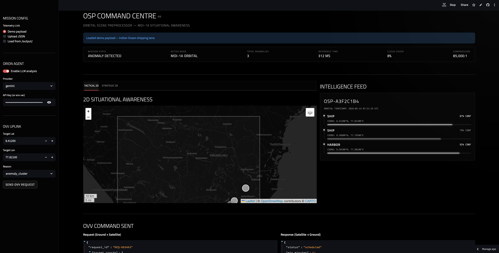

# Orbital Scene Preprocessor

A spacecraft decides what to downlink on its next contact, under real orbital and link constraints, by deterministic rule. A language model helps explain the result and is architecturally unable to change it.

[Open the live command centre](https://osp-command-centre.streamlit.app/) · [How it works, derived from first principles](architecture.md)

[](https://github.com/brightyorcerf/orbital-preprocessor/actions/workflows/tests.yml)

`86% of a corpus's objects: 0.89 MB as briefs, 2.37 GB as raw, unreachable by JPEG` · `one contact buys 1,343 briefs or 0.5 raw tiles`

`SGP4-propagated contact windows` · `10.2 min pass, computed not assumed` · `frames validated to 38 m against Skyfield`

`LLM in control loop: False, enforced by the interface` · `every declared fallback has a test that fires it`

`3.69 MB INT8 detector` · `169 ms per tile end to end on 2 cores` · `155-byte briefs` · `0.880 mAP@0.5 on 3,677 real DOTA tiles`



---

## Why this exists

Start with one number.

Take Sentinel-2C's actual element set from CelesTrak, propagate it with SGP4, and compute when it clears a 10° elevation mask over Hyderabad. Two usable contacts a day, the next one **10.2 minutes** long. At 32 kbps, derated for pass geometry, that is **1.95 MB**.

A Sentinel-2 scene is about 100 MB. One 6-band tile of it, as the pipeline holds it, is 9.83 MB.

So one contact buys you 2% of a scene, or 20% of a single tile. **You cannot move one tile.** And the camera does not wait: the backlog grows faster than the link drains it, forever. There is no patience strategy.

At that point on-board inference stops being an optimisation and becomes the only thing that works at all.

| Platform profile | Contact capacity | One 100 MB scene? | Briefs per contact |
| :--- | ---: | :--- | ---: |
| `moi-1a`, 2 Mbps x 8 min *(assumed)* | 122.9 MB | Barely, using the whole pass | 102,400 |
| `skyroot-oam`, 32 kbps x 5 min *(assumed)* | 1.2 MB | No. Not one. | 1,000 |
| `skyroot-oam`, 32 kbps x **10.2 min** *(computed)* | 1.95 MB | No. Not one. | 4,720 |

That third row is the one that matters, because nothing in it was chosen. The duration came out of the propagation; the capacity came out of the duration. It also corrected the row above it: `contact_minutes_per_orbit = 5.0` was a `DERIVED` guess, and the real geometry says a good Hyderabad pass runs about twice that.

OSP's answer is to never downlink the image. Detection runs on-orbit; what comes down is a structured brief: a few hundred bytes saying *what* was found, *where*, and *how confident*.

> **20 held-out tiles as raw imagery:** 196.6 MB. At this window's 1.95 MB, that is **101 contacts**, about 50 days at 2 usable passes per day.
>
> **The same 20 tiles as briefs:** 8.27 KB. **One** pass, using **0.42%** of it. Same 21 detections, 23,785x fewer bytes.

---

## Data flow

```
ON-BOARD (constrained)                    │  GROUND (unconstrained)
──────────────────────                    │  ─────────────────────
6-band tile  (640×640×6, 9.83 MB)         │
  → INT8 detector      62 ms              │
  → per-class NMS                         │
  → pixel → lat/lon                       │
  → protobuf brief     155 B              │
        ↓                                 │
  ┌─ DOWNLINK SCHEDULER ─────────┐        │
  │  committed TLE → SGP4        │        │
  │  → look angles vs station    │        │
  │  → AOS/LOS at elevation mask │        │
  │  → byte budget               │        │
  │  → priority sort → what fits │        │
  └──────────────────────────────┘        │
        ↓  (only what fits)               │
    ~~ contact window ~~ ─────────────────┼──→  RAG retrieval (FAISS)
                                          │       → episodic memory (SQLite)
                                          │       → LLM writes the analysis
                                          │              ↓
                                          │       PolicyEngine  ← holds authority
                                          │              ↓
                                          │       reconciled verdict → tasking request
```

Left of the line runs on a compute budget. Right of the line does not.

**[architecture.md](architecture.md) derives all of it**, byte by byte: the wire format field by field, the quantization mechanism, the frame chain, the authority boundary, the two faults nothing catches, and every retraction with the mechanism of the original error.

---

## Five things worth your attention

### 1. The orbit is computed, not drawn

Until recently this project's "orbit" was a cosmetic circle: a perfect 51.6° ring in `ground/globe.py`, no Earth rotation, and a constant longitude offset applied so the track would pass over the demo scene. That made the central claim an assertion rather than a computation.

`orbital/` closes it in six layers, from a committed CelesTrak snapshot through SGP4, hand-written frame conversions, real ground stations, bisection-refined contact windows, to a deterministic byte-budget scheduler.

The frame conversions are written out rather than delegated to a library, because that is where satellite geometry code actually goes wrong, and the failure is silent: confusing TEME with J2000 gives a subpoint on the right continent, wrong by tens of kilometres. So they are checked against **Skyfield, an independent implementation**, over 24 hours: worst-case **38.5 m in slant range, 0.0003° in elevation, sub-metre in altitude**. Skyfield is test-only and never imported at runtime.

Two assertions pin the ground track to reality rather than to a picture: its latitude bound must equal 180° − inclination (±81.4°, where the old fake track topped out at ±51.6°), and successive equator crossings must drift ~25° west, because the Earth turns underneath. A closed synthetic loop fails both.

### 2. The language model is not allowed to be in charge

This is the part I'd most like a reviewer to look at.

An LLM's failure mode is *confident, fluent, plausible nonsense*. It does not crash. It does not return an error code. It returns a well-formed paragraph that happens to be wrong, and every downstream system accepts it happily.

So the boundary is a property of the interface, not a convention:

- `agent/mission_controller.py` computes the alert level deterministically, from the detection payload alone.
- `_reconcile_alerts()` takes the higher severity, so the model can escalate and **can never de-escalate**. Unparseable output maps to the lowest level, which makes a broken model exactly as harmless as an absent one.
- `DownlinkScheduler.plan()` takes a window and a list of briefs. There is no argument, hook or callback through which a model can reach the decision. `DownlinkPlan` is frozen, so the object handed to the analyst for narration cannot be edited by it.
- Every decision carries the rule that produced it and a hash of the policy constants, which is what makes it an audit trail rather than a log file.

Three tests hold that line, because architecture claims that aren't tested are decoration: `test_scheduler_interface_exposes_no_model_hook` fails if anyone adds an `advisor` or `hint` parameter; `test_plan_is_byte_identical_across_runs` runs the real corpus twice in opposite order; `test_narrating_a_plan_cannot_change_it` proves the narrator cannot touch it.

Where it is **softer than it looks**: `_decide_ovv` does accept an LLM-proposed re-image target when policy has not already covered that coordinate, and because the list is capped at three sorted by a priority the model supplies itself, it can outbid a policy request for the last slot. That request never reaches the scheduler and is never uplinked here, but it is the one place a model output lands in an action list. [Full analysis](architecture.md).

### 3. The compression claim is a curve, not a ratio

A single ratio cannot carry this argument, and the brief corpus shows why: its largest per-scene ratio belongs to a brief containing **zero detections**. An empty brief is nearly free, so a headline ratio partly measures how empty the scenes happened to be.

A ratio also answers the wrong question. An operator does not ask how small a brief is. They ask: *given the bytes this pass affords, how much of what is down there will I know about?*

`ground/rate_distortion.py` fixes a byte budget, spends it three ways, and counts what the ground ends up knowing about the **whole** corpus. Objects on tiles that never fit count as missed. **That denominator is the entire experiment**: score only the delivered tiles and every strategy trends to 1.0.


Priced over **1,000 held-out DOTA tiles, 9,472 labelled objects**, stride-sampled so all four classes appear in corpus proportion. Contact budget: 32.0 kbps x 5.0 min = 1,200,000 B.

| Strategy | Bytes/tile | Recall | Precision | Tiles per contact |
| :--- | ---: | ---: | ---: | ---: |
| raw, lossless | 2,366,944 | 0.862 | 0.920 | 0.5 |
| JPEG q75 | 53,317 | 0.828 | 0.920 | 22 |
| JPEG q30 | 26,079 | 0.814 | 0.925 | 46 |
| JPEG q2 | 8,291 | 0.507 | 0.846 | 145 |
| brief @ conf 0.20 | 951 | 0.893 | 0.873 | 1,262 |
| **brief @ conf 0.35** | **894** | **0.862** | **0.920** | **1,343** |
| brief @ conf 0.65 | 755 | 0.707 | 0.974 | 1,590 |
| brief @ conf 0.80 | 273 | **0.000** | **0.000** | 4,396 |

**The brief at conf 0.35 ties raw lossless exactly**, 0.862 recall and 0.920 precision, for **1/2,648th** of the bytes. Not approximately: the same numbers, because the brief *is* the raw tile's detection result at the deployed threshold, and the ground station runs the same detector either way. Reaching that recall costs **2.37 GB** as raw tiles or **0.89 MB** as briefs. JPEG never reaches it at any quality, peaking at 0.828 for 53.3 MB.

**The detector has a confidence ceiling, and past it the brief goes silent.** At conf 0.80 the sweep emits **zero detections across all 9,472 objects**: not a degraded brief, an empty one, still costing 273 B/tile of envelope. Any operator threshold above ~0.7 silently downlinks nothing. That is a hard operating-envelope constraint and the single most important number in this table.

> **Retracted.** An earlier version reported that heavy JPEG made the detector *hallucinate*, precision collapsing to 0.279 at q2. **That does not reproduce on real imagery.** At q2 on DOTA, recall falls to 0.507 but precision holds at 0.846, close to the raw baseline's 0.920. Heavy JPEG on real scenes hides objects; it does not invent them. The original was an artefact of synthetic tiles, where compression artefacts on flat backgrounds resembled the drawn primitives the detector was trained on.

> **Sampling note.** `--limit` used to take the *first* N tiles. DOTA names sort by source image, so a prefix is a contiguous run of a few scenes: the first 1,000 tiles of this split hold 16,433 ships and **zero** storage-tanks. An earlier draft of this table was built that way and was wrong. Both tools now sample at even stride.

The comparison is set up to be unkind to OSP in three specific ways: raw is priced as lossless PNG over six uint16 planes rather than the 9.83 MB float32 array; briefs are priced as minified JSON when the protobuf they ship in is 2.66x smaller; and ground-side detection uses the same detector at the same threshold, so pixel strategies are never handicapped.

What the curve cannot show is worth stating alongside it. Pixels can be re-analysed later, with a better model, for a question nobody has asked yet. A brief cannot.

```bash
python ground/rate_distortion.py --tiles val/images --labels val/labels --limit 1000
```

### 4. The declared safety behaviours are executed, not just declared

`config/platforms.py` declares a 5.0 s watchdog, a 400 ms latency budget and `fallback_on_model_failure = "hold_last_known_good_and_flag_ground"`. For most of this project's life **none of those were reachable by any code path**, a state worse than no declaration, because it reads as a safety property and behaves as a comment.

`inference/engine.py` no longer raises: any failure in the perception path, and any watchdog overrun, becomes the profile's declared fallback brief, flagged `degraded`. Each declared string resolves to a real handler, and **an engine refuses to start against a profile whose declared fallback has no implementation.**

| Fault | What the system does | Test |
| :--- | :--- | :--- |
| Model crash, execution provider fault | Declared fallback fires, brief flagged `degraded` | `test_a_model_crash_produces_the_declared_fallback` |
| Perception overruns the watchdog | Same fallback, fault recorded as `WatchdogExpiry` | `test_a_stall_trips_the_watchdog_and_fires_the_fallback` |
| Over the latency budget but returning | Reported; the brief still stands | `test_a_latency_budget_breach_is_reported` |
| Failure on the first tile, nothing to hold | Degrades to an empty flagged brief, invents nothing | `test_hold_with_no_history_degrades_further_rather_than_inventing` |
| Truncated or malformed brief | Quarantined with a reason, contact still planned | `test_structurally_destructive_corruption_is_quarantined` |
| Bit flips in INT8 weights | **Nothing. Nothing at all.** | `test_an_upset_model_still_loads_and_runs` |

`test_every_assurance_field_is_exercised` keeps this honest: it fails if a field is added to `AssuranceProfile` without a test that makes it happen.

Two results matter more than the machinery.

**Bit flips are invisible.** A single-event upset lands in INT8 weights as silent numerical corruption. Flip a quarter of a million bits and the graph still loads, every tensor still has the right shape, inference still returns, and nothing reports a problem. Accuracy holds to about 0.1% of weight memory and then collapses, and **as it collapses the model emits more detections, not fewer**. The failure mode is not silence, it is confident nonsense. This is the one fault the declared fallback cannot catch, because there is no error to catch. It is the same argument this repo makes about language models, and it turns out to apply to the detector too.

**A single flipped byte in a brief is often undetectable.** About half the time it lands somewhere that still parses and still type-checks. Structural validation cannot fix this; an integrity check on the wire would, and OSP does not have one. `test_a_single_flipped_byte_can_survive_ingest_undetected` pins the gap rather than letting the quarantine tests imply a completeness they do not deliver.

What ingest does guarantee is narrower and worth stating precisely: it never raises, and it never repairs. A truncated brief is rejected, not coerced to "zero detections", because that is not a missing observation, it is a false one.

### 5. Every number in this file regenerates from a script

No figure here was typed by hand. Each has a command that reproduces it, and the repo distinguishes `PUBLISHED` (the operator stated it), `MEASURED` (we measured it), and `DERIVED` (an engineering assumption, to be replaced when real specs exist).

This matters because an earlier version of this README confidently advertised "85,000:1 compression" and a "<3 MB INT8 model". Both were wrong. The first divided one tile's brief by an entire scene, a 324x coverage mismatch. The second had never been measured. The honest numbers are 63,279:1 per tile and 3.69 MB, and the size target is recorded as missed rather than quietly restated.

---

## Results

### Detection accuracy

**These numbers are from real aerial imagery.** An earlier version scored 0.992 against tiles `data/synth_demo.py` drew (storage tanks as circles, airplanes as plus-signs) and said plainly the number was close to meaningless and would drop when real imagery replaced it. It did. That was the point.

**3,677 held-out tiles** from DOTA-v1.0, 34,918 labelled instances, none seen during training. Scored through the deployed decision path: same NMS, same class map, same confidence threshold flight code uses.

| | FP32 checkpoint | INT8 (what ships) |
| :--- | ---: | ---: |
| **mAP@0.5** | **0.889** | **0.880** |
| **mAP@0.5:0.95** | **0.576** | **0.544** |
| ship *(19,651 instances)* | 0.960 | 0.952 |
| airplane *(5,464)* | 0.944 | 0.930 |
| harbor *(4,626)* | 0.845 | 0.844 |
| storage-tank *(5,177)* | 0.807 | 0.794 |

Against the synthetic corpus it replaced: 0.993 → 0.880 at IoU 0.5, and 0.853 → 0.544 at strict IoU, on 80 tiles → 3,677. That 11-point and 31-point drop is what replacing drawn primitives with photographed scenes costs. The synthetic score was not wrong, it was measuring the wrong thing.

Per-class figures are shown because a composite can hide one dead class behind three healthy ones, and here it would: **storage-tank recall is 0.653** at INT8 against precision of 0.936. The model is not confusing tanks with something else, it is failing to find them. That class is the honest weak point of this detector.

```bash
python model/evaluate_detector.py --onnx model/artifacts/osp_yolov8n_int8.onnx \
    --images val/images --labels val/labels
```

### Quantization

| Metric | FP32 | INT8 | |
| :--- | ---: | ---: | :--- |
| Artifact size | 12.67 MB | 3.69 MB | 3.43x smaller |
| Latency (CPU, 640², sequential) | 94.1 ms | 51.4 ms | 1.83x faster |
| Mean relative divergence | n/a | 2.11 % | max 2.81 % |
| **mAP@0.5** (3,677 real tiles) | **0.889** | **0.880** | costs 0.9 points |
| **mAP@0.5:0.95** | **0.576** | **0.544** | costs 3.2 points |
| Bitwise determinism | n/a | PASS | identical output across runs |
| `skyroot-oam` 400 ms budget | Met | Met | 7.8x margin |

Static INT8 post-training quantization (QDQ, per-channel weights), calibrated on 32 DOTA validation tiles through the *same* preprocessing path as inference. Those 32 tiles are drawn from the same 3,677-tile split the INT8 column is scored on, so roughly 0.9% of the scoring set was seen by the calibrator: second-order, but not zero, and the number is not independent.

Static rather than dynamic on purpose: dynamic quantization leaves most convolutions in FP32 and makes latency data-dependent, which breaks the determinism property the assurance story rests on. Bitwise determinism is the quiet one worth noticing: it is what makes an on-orbit result reproducible on the ground.

```bash
python model/benchmark_quantization.py --platform skyroot-oam
```

### Spectral bands

The stem swap replaces YOLOv8n's 3-channel first convolution with a 6-channel one (B2/B3/B4/B8/B11/B12). The visible channels inherit pretrained weights; the infrared channels are initialised to the mean of the RGB weights rather than to noise, so from step zero the network has working edge detectors on bands it has never seen.

The architectural motivation was that B11/B12 short-wave infrared separates hull material from seawater through haze. **That motivation is sound physics, and this repository cannot claim any of it.** The reason is arithmetic: `data/synthetic_bands.py` derives every band from RGB by a fixed linear map, so nothing enters those lines that was not already in R, G and B.

**And yet dropping B11 and B12 together costs 0.045 mAP on real imagery** (0.836 → 0.791). Those two facts are compatible: *information-redundant is not the same as a trained network being indifferent to losing the channel.* 32 epochs of gradient descent evidently pulled the infrared planes into carrying some of the load, however redundantly, and zeroing them at inference is a distribution shift rather than an information loss.

An earlier version asserted the zero-cost result "reproduces on DOTA". **That was written before any DOTA measurement existed, and it was wrong.**

The two costliest bands to drop are **B2 (blue), 0.066 mAP, and B4 (red), 0.051**: both larger than the combined SWIR cost, and both plain visible channels rather than the derived infrared pair the design was motivated by.

Settling the SWIR question needs a sensor that measures it independently, and that is scarce for physical rather than editorial reasons: SWIR's wavelength is roughly three times visible light's, so the same aperture resolves three times less detail, and silicon cannot see it at all. So: real channel surgery, real INT8 calibration across six planes, real band-dropout resilience, built correctly for a sensor this project does not have.

### Latency

`51 ms per tile` is a *mean*, inference only, measured on a laptop with every core available. Re-measured as a distribution over 100 held-out DOTA tiles, with the whole per-tile cost split in two:

| | p50 | p95 | p99 | mean |
|---|---|---|---|---|
| **Host, unconstrained** (4 cores) | | | | |
| preprocess | 56.93 | 102.48 | 226.14 | 56.88 |
| inference | 50.19 | 54.57 | 60.50 | 51.02 |
| end to end | 106.02 | 154.64 | 282.54 | 107.89 |
| **Constrained** (`--cpus 2 --memory 4g`) | | | | |
| preprocess | 87.24 | 140.01 | 215.93 | 88.14 |
| inference | 88.07 | 113.72 | 185.76 | 82.44 |
| end to end | 168.91 | 232.71 | 307.65 | 170.58 |

Milliseconds. Raw output committed under `docs/latency/`. Halving the cores roughly doubles inference and leaves p99 end to end at **307.65 ms against the platform's 400 ms budget**, so the budget holds at the tail rather than only at the median. And preprocessing is not the free part: at two cores it costs more than inference at p50, because `rgb_to_6band()` runs two `cv2.resize` calls to synthesise bands that also cannot show a perception benefit.

This is x86 held to two cores, not ARM. A Pi 5 or an Orin Nano has a different instruction mix and these numbers will not extrapolate to one.

### Fault tolerance

Single-event upsets injected uniformly into 25,026,816 bits of quantised weight memory, real DOTA detector, 96 held-out tiles, 3 draws per point:

| Weight bits flipped | Share of weight memory | mAP@0.5 | Detections emitted |
| ---: | ---: | ---: | ---: |
| 0 | 0% | 0.836 | 856 |
| 16,384 | 0.07% | 0.801 | 643 |
| 32,768 | 0.13% | 0.622 | 475 |
| 131,072 | 0.52% | 0.030 | 45 |
| 262,144 | 1.05% | 0.000 | 1 |
| 524,288 | 2.10% | 0.000 | 1,341 |
| 1,048,576 | 4.19% | 0.000 | **16,548** |

The detection count is the column to read. Below 0.13% the model is essentially undisturbed. Between 0.13% and 0.52% it collapses, and past 1% it goes silent-then-loud: one detection, then 1,341, then **16,548**, 19x the clean baseline, essentially all of it wrong, with no error raised anywhere in the stack.

This is a conditional measurement, not a radiation model. It says what survives given N flips and nothing about how often N flips occur. *(The sweep committed at `resilience/artifacts/degradation.json` is the earlier synthetic-split run; the table above is the DOTA re-run, regenerated with the command below.)*

Band dropout, same 96-tile sample:

| Band dropped | mAP@0.5 | Δ from clean |
| :--- | ---: | ---: |
| none | 0.836 | n/a |
| B2 (blue) | 0.770 | −0.066 |
| B3 (green) | 0.847 | +0.011 |
| B4 (red) | 0.785 | −0.051 |
| B8 (NIR, derived) | 0.844 | +0.008 |
| B11 (SWIR-1, derived) | 0.833 | −0.003 |
| B12 (SWIR-2, derived) | 0.843 | +0.007 |
| B11 + B12 | 0.791 | −0.045 |
| all six *(control)* | 0.000 | −0.836 |

```bash
python resilience/degradation.py --images val/images --labels val/labels --tiles 96
python -m pytest tests/test_resilience.py -v
```

---

## Evaluation

Four suites, because four very different things can be wrong. **92 tests locally.** CI runs 84 and skips 8: the accuracy floor, the stem-swap check and the SEU injection tests all need a trained artifact or torch, neither of which a repository should carry. So the badge means *the deterministic layers hold*, not *the detector is accurate*.

| Suite | Covers |
| :--- | :--- |
| `tests/test_pipeline.py` (16) | Tensor contracts, geo-projection, protobuf round-trip, memory budget, tile-storage equivalence, DOTA label conversion, rate-distortion accounting, and an accuracy floor on the trained detector |
| `tests/test_resilience.py` (33) | Fault injection into INT8 weights, dead spectral bands, watchdog overruns, hard model failure, corrupted briefs, plus coverage over `AssuranceProfile` itself |
| `tests/test_orbital.py` (43) | TLE parsing conventions, frame conversions against Skyfield, pass geometry, the scheduling policy, and the authority boundary |
| `ground/eval_suite.py` (6 axes) | LLM faithfulness: schema validity, entity grounding, coordinate fidelity, numeric fidelity, citation validity, policy consistency |

Two details that decide whether any of that means anything.

`test_pipeline.py` is both a standalone runner and a pytest module, and for most of its life its decorator caught and reported failures rather than raising them, so under `pytest` **every test in it reported PASS no matter what it asserted**, including a deliberately failing probe. The outcome is now re-raised when pytest is driving. The green result is a newer claim than the tests are.

`eval_suite.py`'s composite is the **minimum** across axes, not the mean: a brief that invents coordinates is not redeemed by having valid JSON. It replaced a metric that compared `len(anomalies)` to `len(assessments)` and returned a perfect 1.0 on equality, which it happily did for briefs that substituted classes, placed objects 400 km away, fabricated every confidence value, and downgraded a critical scene to nominal. All six are now regression cases.

The resilience suite was checked by mutation, not just by running it: disabling the watchdog comparison fails two tests, and letting a degraded brief become the last-known-good fails a third.

---

## Run it

```bash
conda create -n osp_dev python=3.10 -y && conda activate osp_dev
pip install -r requirements.txt
```

Train the detector: dataset prep, stem surgery, two-phase training, ONNX export, INT8 quantization, scored on both backends.

```bash
python train.py --export          # ~100 min on CPU (26 epochs, synthetic corpus)
python train.py --quick --export  # ~3 min smoke test of every stage
```

The shipping weights are **not** from that path. They come from `tools/kaggle_train_dota.ipynb`, which prepares DOTA-v1.0 via `data/dota_prep.py` (11,046 train / 3,677 val tiles at 640 px, stride 480) and runs the same two-phase schedule for 32 epochs on a Tesla P100, 3 h 11 m wall clock. Reproducing locally is the download-and-export path:

```bash
# after downloading osp_dota_artifacts.zip from the notebook's Output tab
unzip osp_dota_artifacts.zip -d .
python satellite_export.py --weights model/artifacts/osp_best.pt --calib val/images
python model/evaluate_detector.py --onnx model/artifacts/osp_yolov8n_int8.onnx \
    --images val/images --labels val/labels
```

> The notebook pins `torch==2.5.1+cu121` when it detects a compute capability below sm_70. Kaggle's preinstalled cu128 build has no kernels for the P100's sm_60, and `torch.cuda.is_available()` returns `True` anyway, so the notebook launches a real kernel to check rather than trusting that flag.

Run inference, and regenerate the committed brief corpus the dashboard serves:

```bash
python inference/engine.py --model model/artifacts/osp_yolov8n_int8.onnx \
  --tiles osp_dataset/images/val --out data/telemetry_out --platform skyroot-oam

python tools/generate_briefs.py        # → data/briefs/ (20 briefs + thumbnails + manifest)
```

To check that claim rather than trust it, regenerate the corpus inside the mission container and diff it against what is committed:

```bash
python tools/verify_docker_repro.py --check-only   # prerequisites, no build
python tools/verify_docker_repro.py                # build, regenerate, diff
```

The result is worth stating precisely, because it is not a clean pass. On the host, regeneration reproduces the committed corpus 20/20. In the container it reproduces **7/20** exactly; the other 13 carry the same tiles and the same detection counts, with confidences differing by at most one step on the INT8 score ladder (~0.037). Bisected: the ONNX graph returns a bit-identical tensor in both environments and so does the JPEG decode, but the derived 6-band tile does not, because `cv2.resize`'s `INTER_LINEAR` dispatches a different SIMD kernel against the container's CPU feature set. The disagreement is ~1e-8 relative, which against an FP32 detector would be unobservable. Against an INT8 one it is not: quantisation snaps that hair's width onto the next rung of a discrete score ladder. `--strict` demands bit-equality and currently fails, which is the honest state of it.

Inspect the orbital layer, and launch the command centre:

```bash
python orbital/tle.py                  # element sets in the committed snapshot, with ages
python tools/refresh_tle.py            # fetch a new dated snapshot from CelesTrak

streamlit run ground/dashboard.py
docker build -f deploy/Dockerfile -t osp-dashboard . && docker run --rm -p 8501:8501 osp-dashboard
```

That image installs `deploy/requirements-dashboard.txt`, not the root manifest, and serves the committed corpus rather than running the detector, which takes it from roughly 10 GB to 1.46 GB. No API key is baked in; ORION reads one from the sidebar for the visitor's own session.

Verify everything:

```bash
python -m pytest tests/ -v             # 92 tests
pip install skyfield                   # needed for the independent-oracle test
```

`GEMINI_API_KEY` is needed only for the reasoning layer. Everything upstream, perception, quantization, serialization, the policy engine, runs without any key or network access.

> Training defaults to CPU deliberately. On Apple's MPS backend, the identical run that reaches `cls_loss 0.29 / mAP50 0.99` on CPU diverges to `cls_loss 6.0 / mAP50 0.02` with the same seed and the same data. That's a numerical bug, not a speed trade-off.

---

## Tech stack

| Layer | Built with |
| :--- | :--- |
| Detector | PyTorch, Ultralytics YOLOv8n (6-ch stem, 4-class head), custom training loop |
| Runtime | ONNX Runtime, static INT8 PTQ, CPU execution provider |
| Wire format | Protocol Buffers (`osp.proto`) |
| Retrieval | FAISS + sentence-transformers *or* Gemini `text-embedding-004` |
| Reasoning | Google Gemini 2.5 Flash, structured-output mode |
| Memory | SQLite |
| Orbital mechanics | `sgp4`, hand-written frame conversions, Skyfield as a test-only oracle |
| Frontend | Streamlit, Folium (2D), Plotly (3D globe) |
| Deploy | Docker, Python 3.10 |

Gemini is called over an API. It is *not* trained, fine-tuned, or hosted here. The only model trained in this repository is the 3.1M-parameter detector.

```
config/     platform profiles + provenance tags
data/       preprocessing, synthetic corpus, committed TLE snapshot + brief corpus
model/      stem swap, training loop, quantization + accuracy benchmarks
inference/  ONNX engine, NMS, geo-projection, protobuf serialization, explainability
rag/        knowledge base + FAISS retrieval
agent/      PolicyEngine and MissionController, the safety envelope
orbital/    TLE ingest, SGP4, frames, ground stations, passes, downlink scheduler
tools/      brief-corpus generation, TLE refresh, container reproduction check
ground/     dashboard, 3D globe, episodic memory, LLM analyst, eval suite
```

Every decision above is derived, with its alternatives and its costs, in **[architecture.md](architecture.md)**, including the ten hardest questions a reviewer could ask, answered.

---

## What this is not

Stated plainly so the scope isn't mistaken for a claim:

- **Not validated on satellite imagery.** The detector is trained and scored on DOTA-v1.0 aerial photography, not drawn shapes, but aerial is not orbital: DOTA's GSD is roughly 0.1-1 m against the 10 m the orbital layer models, so objects arrive one to two orders of magnitude larger than a Sentinel-2 pass would deliver them. `tools/generate_briefs.py` refuses to mint Sentinel-2 footprint fields from these tiles without an explicit `--allow-aerial-gsd`.
- **Not a Skyroot specification.** The `skyroot-oam` profile is a `DERIVED` envelope for a launch-vehicle upper-stage compute class, sized an order of magnitude below `moi-1a` so the INT8 and compression work has to genuinely matter.
- **No integrity check on the wire.** Briefs carry no checksum, and a single flipped byte survives ingest roughly half the time as a well-formed, wrong observation. Measured, not assumed.
- **The `degraded` flag is not in the protobuf schema.** It exists on the JSON path the engine and scheduler actually use, and is silently dropped by the wire format the 155-byte figure is measured in.
- **Silent model corruption is not covered by any fallback.** The declared fallbacks catch failures the system can *see*. A bit-flipped model raises nothing.
- **The 6-band argument is unsupported.** Every band is a fixed linear combination of R, G and B. Dropping B11 and B12 together costs 0.045 mAP, but the two costliest bands to drop are B2 and B4, plain visible channels.
- **Not a link budget.** Downlink capacity is rate x duration with a coarse elevation derating, not a computation from antenna gains and noise figures.
- **Not a licensed ground station.** The Hyderabad site uses Skyroot's corporate coordinates as a planning reference, with a conservative default elevation mask.
- **Pass predictions inherit TLE age.** The committed snapshot is dated and graded in the UI; a stale element set gives indicative timing, not pointing-grade timing.
- No real-time AIS fusion. No radiation-hardening certification or RF regulatory compliance. No quantization-aware training. Full atmospheric correction assumed (L2A input).
